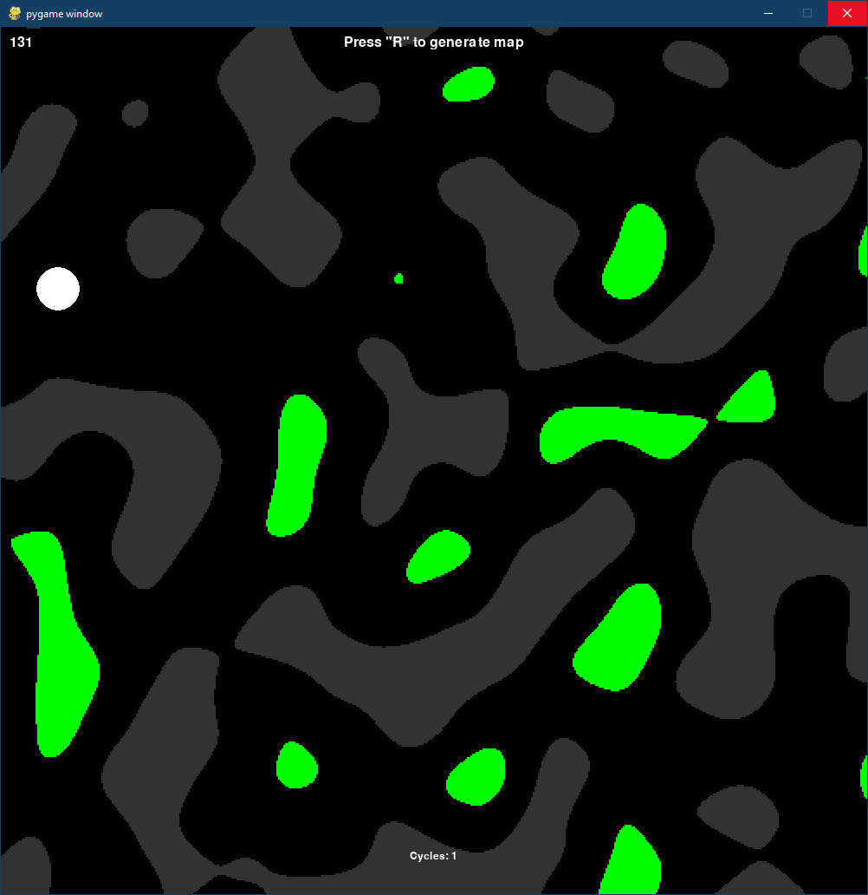

# PyPerlinNoise - Cavegenerator for AntSim
Randomly creates a Cave with:
- Walls (grey)
- Food-Sources (Green)
    - not colliding with walls
    - not nearby of Ant-Nest (white)
- Nest (white)
    - checks for walls

## HowTo
Start:

run <kbd>main.py</kbd>

Drawing on the Cave:
- Blue: <kbd>ALT</kbd> 
- Green: <kbd>⇧ SHIFT</kbd>
- Red: <kbd>^ Ctrl</kbd> 

Generate Map:
- <kbd>R</kbd> 
### Install
`$ pip install -r requirements.txt`

### Configure
Settings in `config.ini`

## Screenshot
